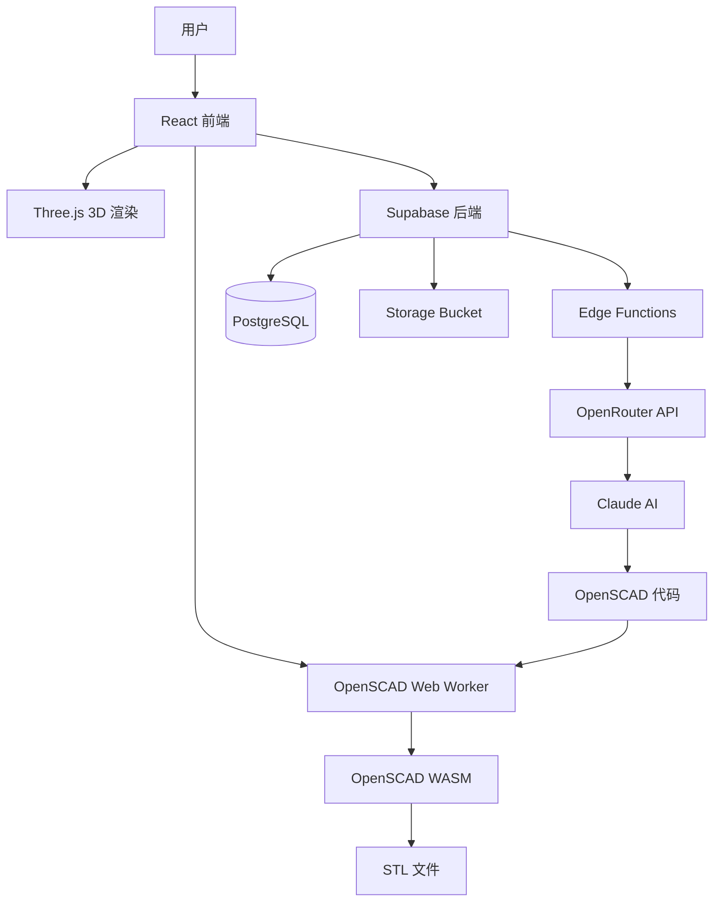
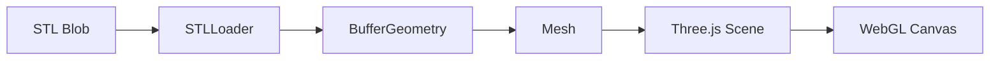
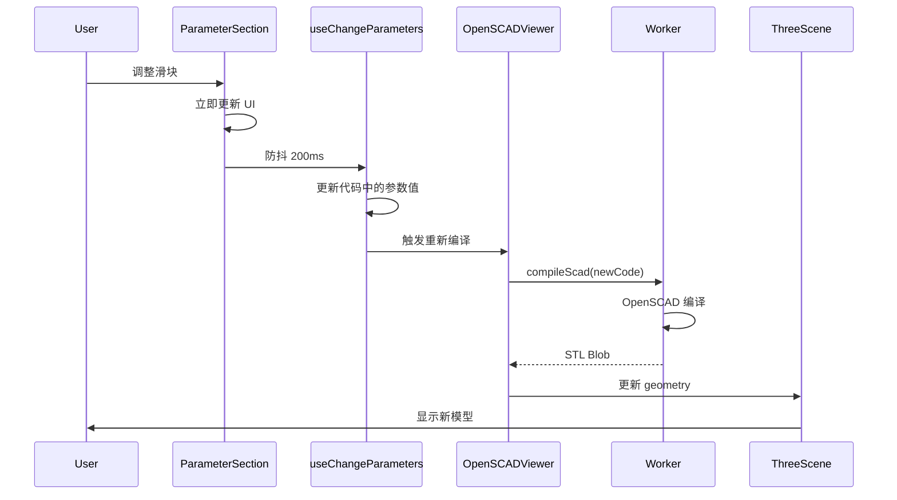
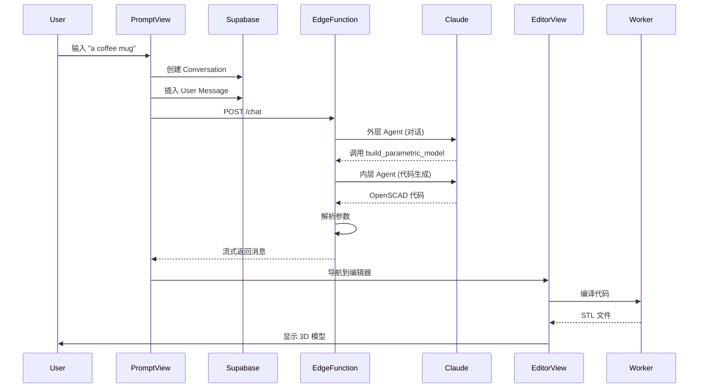
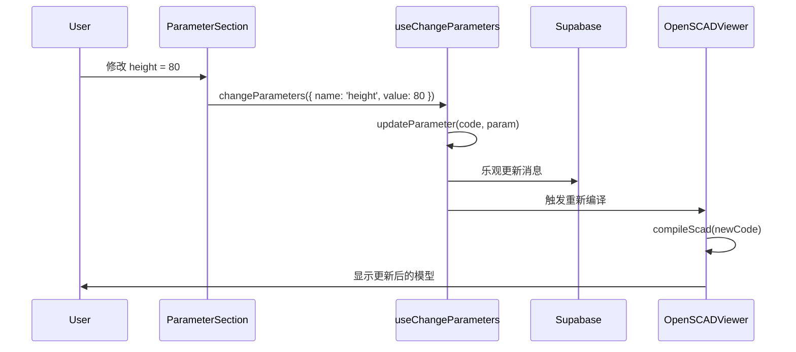
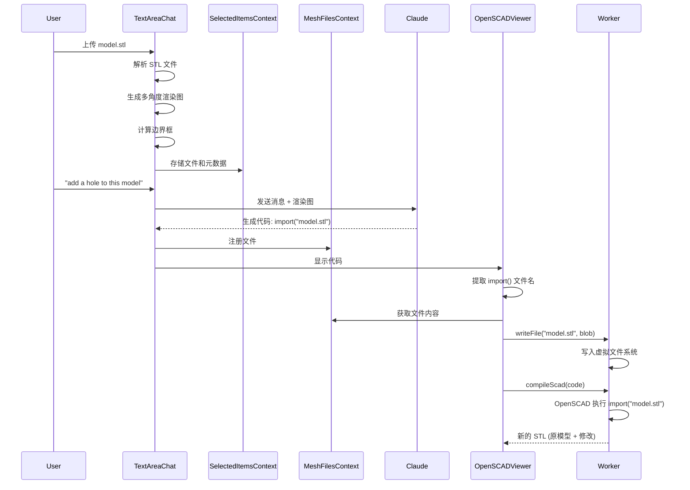

# CADAM 项目源码详细分析

## 一、项目概述

**CADAM** 是一个开源的 **AI 驱动的参数化 3D CAD 建模 Web 应用**,允许用户通过自然语言描述或图片上传来生成可编辑的 3D 模型。

### 核心价值主张

- 🤖 **AI 驱动生成**: 使用 Claude AI 将自然语言转换为 OpenSCAD 代码
- 🎛️ **参数化建模**: 自动提取可调参数,实时预览修改效果
- 🌐 **纯浏览器运行**: 基于 WebAssembly 的 OpenSCAD 编译器
- 📦 **多格式导出**: 支持 STL (3D 打印) 和 SCAD (源码) 格式

### 技术栈

- **前端**: React 19 + TypeScript + Vite
- **3D 渲染**: Three.js + React Three Fiber
- **CAD 引擎**: OpenSCAD WASM
- **后端**: Supabase (PostgreSQL + Edge Functions)
- **AI**: Anthropic Claude (通过 OpenRouter)
- **UI 库**: Tailwind CSS + shadcn/ui

---

## 二、项目架构设计

### 2.1 整体架构图



### 2.2 前端架构

#### 目录结构

```
src/
├── views/              # 页面级组件
│   ├── PromptView      # 首页/新对话
│   ├── EditorView      # 编辑器主界面
│   └── HistoryView     # 历史记录
├── components/         # 可复用组件
│   ├── chat/          # 聊天相关
│   ├── viewer/        # 3D 查看器
│   ├── parameter/     # 参数控制
│   ├── history/       # 历史记录
│   ├── auth/          # 认证
│   └── ui/            # shadcn/ui 基础组件
├── contexts/          # React Context 状态管理
├── hooks/             # 自定义 Hooks
├── services/          # API 服务层
├── utils/             # 工具函数
├── types/             # TypeScript 类型
├── worker/            # Web Worker (OpenSCAD)
└── lib/               # 库配置
```

#### 状态管理策略

**服务器状态 (React Query)**:

- `conversations`: 对话列表和详情
- `messages`: 消息历史
- 自动缓存、乐观更新、后台同步

**客户端状态 (React Context)**:

- `AuthContext`: 用户认证
- `CurrentMessageContext`: 当前选中消息
- `BlobContext`: STL 文件数据
- `ColorContext`: 模型颜色
- `SelectedItemsContext`: 上传的图片/文件
- `MeshFilesContext`: OpenSCAD 导入的外部文件

### 2.3 后端架构

#### 数据库结构

**核心表**:

- `conversations`: 对话记录
  - `id`, `user_id`, `title`, `current_message_leaf_id`
  - 支持消息树结构 (分支对话)
- `messages`: 消息记录
  - `id`, `conversation_id`, `role`, `content` (JSONB)
  - `parent_message_id` (实现树形结构)
  - 触发器自动更新对话的 `current_message_leaf_id`

**Storage Buckets**:

- `images`: 用户上传的图片 (按 user_id 分文件夹)

**Row Level Security (RLS)**:

- 用户只能访问自己的对话和消息
- 基于 `auth.uid()` 的策略

#### Edge Functions

`**chat/` 函数\*\* (`[supabase/functions/chat/index.ts](supabase/functions/chat/index.ts)`):

- 核心 AI 对话处理函数
- 使用 OpenRouter API 调用 Claude 模型
- 支持流式响应 (Server-Sent Events)
- 实现两阶段 AI 调用:
  1. **外层 Agent**: 对话管理 + 工具调用
  2. **内层 Agent**: 纯 OpenSCAD 代码生成

**工具 (Tools)**:

1. `build_parametric_model`: 生成/更新 OpenSCAD 模型
2. `apply_parameter_changes`: 快速参数更新 (无需重新生成)

---

## 三、核心功能实现原理

### 3.1 AI 驱动的代码生成

#### 双层 AI 架构

**外层 Agent (对话层)**:

- **Prompt**: `PARAMETRIC_AGENT_PROMPT`
- **职责**:
  - 与用户对话,理解意图
  - 决定调用哪个工具
  - 生成简短的回复文本
- **工具**: `build_parametric_model`, `apply_parameter_changes`

**内层 Agent (代码生成层)**:

- **Prompt**: `STRICT_CODE_PROMPT`
- **职责**:
  - 纯粹的 OpenSCAD 代码生成
  - 确保代码语法正确
  - 支持参数化设计
  - 处理 STL 导入 (`import("filename.stl")`)
- **输出**: 纯 OpenSCAD 代码 (无 Markdown 包装)

#### 流式响应处理

```typescript
// 后端流式发送消息更新
function streamMessage(controller, message) {
  controller.enqueue(new TextEncoder().encode(JSON.stringify(message) + '\n'));
}

// 前端实时解析并更新 UI
const reader = response.body.getReader();
while (true) {
  const { done, value } = await reader.read();
  if (done) break;

  // 解析 SSE 数据
  const chunk = JSON.parse(data);

  // 更新文本内容
  if (delta.content) {
    content.text += delta.content;
  }

  // 处理工具调用
  if (delta.tool_calls) {
    // 累积工具参数
  }
}
```

#### 参数解析

**后端解析** (`[supabase/functions/_shared/parseParameter.ts](supabase/functions/_shared/parseParameter.ts)`):

```typescript
// 正则匹配参数定义
const parameterRegex =
  /^([a-z0-9A-Z_$]+)\s*=\s*([^;]+);[\t\f\cK ]*(\/\/[^\n]*)?/gm;

// 解析注释中的元数据
// [0:100]       → range: { min: 0, max: 100 }
// [0:1:100]     → range: { min: 0, step: 1, max: 100 }
// [opt1:Label1, opt2:Label2] → options: [...]
// // Description → description: "Description"
```

**前端更新** (`[src/utils/parameterUtils.ts](src/utils/parameterUtils.ts)`):

```typescript
// 使用正则替换更新参数值
function updateParameter(code: string, param: Parameter): string {
  const regex = new RegExp(`^\\s*(${escapedName}\\s*=\\s*)[^;]+;`, 'm');
  return code.replace(regex, `$1${param.value};$2`);
}
```

### 3.2 OpenSCAD 编译流程

#### Web Worker 架构

**为什么使用 Web Worker?**

- OpenSCAD 编译是 CPU 密集型操作
- Worker 在独立线程运行,避免阻塞主线程 UI
- 使用 Transferable Objects 实现零拷贝文件传输

**Worker 消息类型**:

```typescript
type WorkerMessageType =
  | 'preview' // 生成 STL 预览
  | 'export' // 导出文件
  | 'fs.read' // 读取虚拟文件系统
  | 'fs.write' // 写入文件
  | 'fs.unlink'; // 删除文件
```

#### 编译步骤

**1. 初始化 OpenSCAD WASM** (`[src/worker/openSCAD.ts:31-77](src/worker/openSCAD.ts)`):

```typescript
async getInstance(): Promise<OpenSCAD> {
  const instance = await openscad({
    noInitialRun: true,
    print: this.logger('stdOut'),
    printErr: this.logger('stdErr'),
  });

  // 设置字体
  instance.FS.writeFile('/fonts/Geist-Regular.ttf', fontData);

  // 写入用户上传的文件
  for (const file of this.files) {
    instance.FS.writeFile(file.path, content);
  }

  return instance;
}
```

**2. 动态加载库** (`[src/worker/openSCAD.ts:276-384](src/worker/openSCAD.ts)`):

```typescript
// 检测代码中使用的库
for (const library of libraries) {
  if (code.includes(library.name)) {
    // 下载并解压库文件
    const response = await fetch(library.url);
    const zip = await response.blob();
    const files = await new ZipReader(new BlobReader(zip)).getEntries();

    // 写入虚拟文件系统
    files.forEach((f) => {
      instance.FS.writeFile(`/libraries/${library.name}/${f.filename}`, data);
    });
  }
}
```

**3. 执行编译**:

```typescript
// 写入代码到虚拟文件系统
instance.FS.writeFile('/input.scad', code);

// 调用 OpenSCAD 命令行
const args = [
  '/input.scad',
  '-o',
  '/out.stl',
  '-Dwidth=100', // 参数传递
  '--enable=manifold',
  '--enable=fast-csg',
];
const exitCode = instance.callMain(args);

// 读取输出
const output = instance.FS.readFile('/out.stl', { encoding: 'binary' });
```

**4. 前端集成** (`[src/hooks/useOpenSCAD.ts](src/hooks/useOpenSCAD.ts)`):

```typescript
const compileScad = useCallback(async (code: string) => {
  setIsCompiling(true);

  const worker = getWorker();
  const message: WorkerMessage = {
    type: 'preview',
    data: { code, params: [], fileType: 'stl' },
  };

  // 使用 Transferable Objects 零拷贝传输
  worker.postMessage(message, [arrayBuffer]);

  // 监听响应
  worker.onmessage = (event) => {
    const blob = new Blob([event.data.output], { type: 'model/stl' });
    setOutput(blob);
    setIsCompiling(false);
  };
}, []);
```

### 3.3 3D 渲染管线

#### 渲染流程



#### 关键组件

**OpenSCADViewer** (`[src/components/viewer/OpenSCADViewer.tsx](src/components/viewer/OpenSCADViewer.tsx)`):

```typescript
useEffect(() => {
  if (!scadCode) return;

  // 1. 处理 import() 文件
  const importedFiles = extractImportFilenames(scadCode);
  for (const filename of importedFiles) {
    const meshContent = getMeshFile(filename);
    if (meshContent) {
      await writeFile(filename, meshContent);
    }
  }

  // 2. 编译代码
  compileScad(scadCode);
}, [scadCode]);

useEffect(() => {
  if (output) {
    // 3. 解析 STL
    const buffer = await output.arrayBuffer();
    const loader = new STLLoader();
    const geometry = loader.parse(buffer);

    // 4. 居中和计算法线
    geometry.center();
    geometry.computeVertexNormals();

    setGeometry(geometry);
  }
}, [output]);
```

**ThreeScene** (`[src/components/viewer/ThreeScene.tsx](src/components/viewer/ThreeScene.tsx)`):

```typescript
<Canvas>
  <PerspectiveCamera position={[-100, 100, 100]} />

  {/* 多方向光照 */}
  <ambientLight intensity={0.8} />
  <directionalLight position={[5, 5, 5]} intensity={1.2} castShadow />

  {/* 3D 模型 */}
  <mesh geometry={geometry} rotation={[-90, 0, 0]}>
    <meshStandardMaterial
      color={color}
      metalness={0.6}
      roughness={0.3}
      envMapIntensity={0.3}
    />
  </mesh>

  {/* 交互控制 */}
  <OrbitControls />
  <GizmoViewcube />
</Canvas>
```

#### 相机系统

**正交相机 (Orthographic)**:

- 无透视变形,适合工程图
- 默认缩放: 40

**透视相机 (Perspective)**:

- 真实透视效果
- FOV: 45°

### 3.4 实时参数调整

#### 防抖优化

```typescript
// ParameterSection.tsx
const debouncedChangeParameters = useMemo(
  () => debounce(changeParameters, 200),
  [changeParameters],
);

const handleParameterChange = (param: Parameter) => {
  // 立即更新 UI
  setLocalParameters((prev) =>
    prev.map((p) => (p.name === param.name ? param : p)),
  );

  // 防抖后触发编译
  debouncedChangeParameters(param);
};
```

#### 参数更新流程



---

## 四、主要业务流程

### 4.1 创建新模型流程



**关键代码**:

**1. 发送消息** (`[src/services/messageService.ts](src/services/messageService.ts)`):

```typescript
export function useSendContentMutation({ conversation }) {
  return useMutation({
    mutationFn: async (content: Content) => {
      // 1. 插入用户消息
      const userMessage = await insertMessage({
        conversation_id: conversation.id,
        role: 'user',
        content,
        parent_message_id: conversation.current_message_leaf_id,
      });

      // 2. 调用 Edge Function
      const response = await fetch('/chat', {
        method: 'POST',
        body: JSON.stringify({
          messageId: userMessage.id,
          conversationId: conversation.id,
          model: content.model,
        }),
      });

      // 3. 流式接收响应
      const reader = response.body.getReader();
      while (true) {
        const { done, value } = await reader.read();
        if (done) break;

        const message = JSON.parse(decoder.decode(value));

        // 4. 实时更新 QueryClient 缓存
        queryClient.setQueryData(['messages', conversation.id], (old) => {
          return [...old, message];
        });
      }
    },
  });
}
```

**2. Edge Function 处理** (`[supabase/functions/chat/index.ts:392-1053](supabase/functions/chat/index.ts)`):

```typescript
// 流式响应
const responseStream = new ReadableStream({
  async start(controller) {
    // 1. 调用外层 Agent
    const response = await fetch(OPENROUTER_API_URL, {
      method: 'POST',
      body: JSON.stringify({
        model,
        messages: [
          { role: 'system', content: PARAMETRIC_AGENT_PROMPT },
          ...messagesToSend,
        ],
        tools,
        stream: true,
      }),
    });

    // 2. 处理流式响应
    while (true) {
      const chunk = await reader.read();

      // 累积文本
      if (delta.content) {
        content.text += delta.content;
        streamMessage(controller, { ...newMessageData, content });
      }

      // 累积工具调用
      if (delta.tool_calls) {
        currentToolCall.arguments += toolCall.function.arguments;
      }

      // 工具调用完成
      if (finish_reason === 'tool_calls') {
        await handleToolCall(currentToolCall);
      }
    }
  },
});

// 3. 处理工具调用
async function handleToolCall(toolCall) {
  if (toolCall.name === 'build_parametric_model') {
    // 调用内层 Agent 生成代码
    const codeResult = await fetch(OPENROUTER_API_URL, {
      body: JSON.stringify({
        model,
        messages: [
          { role: 'system', content: STRICT_CODE_PROMPT },
          ...codeMessages,
        ],
      }),
    });

    const code = codeResult.choices[0].message.content;

    // 解析参数
    const parameters = parseParameters(code);

    // 生成标题
    const title = await generateTitleFromMessages(messagesToSend);

    // 创建 artifact
    content.artifact = {
      title,
      version: 'v1',
      code,
      parameters,
    };

    streamMessage(controller, { ...newMessageData, content });
  }
}
```

### 4.2 参数调整流程



**关键代码** (`[src/services/messageService.ts](src/services/messageService.ts)`):

```typescript
export function useChangeParameters() {
  return useMutation({
    mutationFn: async ({ parameters }) => {
      // 1. 更新代码中的参数值
      let newCode = currentMessage.content.artifact.code;
      for (const param of parameters) {
        newCode = updateParameter(newCode, param);
      }

      // 2. 重新解析参数
      const newParameters = parseParameters(newCode);

      // 3. 创建新的 artifact
      const newArtifact = {
        ...currentMessage.content.artifact,
        code: newCode,
        parameters: newParameters,
      };

      return newArtifact;
    },
    onMutate: async ({ parameters }) => {
      // 乐观更新:立即更新 UI
      queryClient.setQueryData(['messages', conversationId], (old) => {
        return old.map((msg) =>
          msg.id === currentMessage.id
            ? { ...msg, content: { ...msg.content, artifact: newArtifact } }
            : msg,
        );
      });
    },
    onSuccess: async (newArtifact) => {
      // 持久化到数据库
      await supabase
        .from('messages')
        .update({ content: { artifact: newArtifact } })
        .eq('id', currentMessage.id);
    },
  });
}
```

### 4.3 STL 文件导入流程



**关键代码**:

**1. 文件上传处理** (`[src/components/TextAreaChat.tsx](src/components/TextAreaChat.tsx)`):

```typescript
const handleFileUpload = async (file: File) => {
  if (file.name.endsWith('.stl')) {
    // 1. 读取文件
    const arrayBuffer = await file.arrayBuffer();
    const blob = new Blob([arrayBuffer], { type: 'model/stl' });

    // 2. 生成多角度渲染图
    const renders = await generateMeshRenders(blob);

    // 3. 计算边界框
    const boundingBox = calculateBoundingBox(arrayBuffer);

    // 4. 存储到 Context
    setMeshUpload({
      file: blob,
      filename: file.name,
      boundingBox,
      meshRenders: renders,
    });
  }
};
```

**2. Worker 文件写入** (`[src/hooks/useOpenSCAD.ts](src/hooks/useOpenSCAD.ts)`):

```typescript
const writeFile = useCallback(async (path: string, content: Blob) => {
  const worker = getWorker();
  const arrayBuffer = await content.arrayBuffer();

  const message: WorkerMessage = {
    type: 'fs.write',
    data: { path, content: arrayBuffer, type: content.type },
  };

  // 零拷贝传输
  worker.postMessage(message, [arrayBuffer]);

  writtenFilesRef.current.add(path);
}, []);
```

**3. OpenSCAD 编译时读取** (`[src/worker/openSCAD.ts](src/worker/openSCAD.ts)`):

```typescript
async getInstance(): Promise<OpenSCAD> {
  const instance = await openscad({ ... });

  // 写入所有已注册的文件
  for (const file of this.files) {
    const content = await file.arrayBuffer();
    instance.FS.writeFile(file.path, new Int8Array(content));
  }

  return instance;
}
```

---

## 五、性能优化策略

### 5.1 编译优化

**1. Web Worker 隔离**:

- OpenSCAD 编译在独立线程,不阻塞 UI
- 使用 Transferable Objects 零拷贝传输大文件

**2. 防抖处理**:

- 参数调整 200ms 防抖,避免频繁编译

**3. 增量更新**:

- 简单参数修改使用 `apply_parameter_changes` 工具
- 仅替换参数值,无需重新生成整个模型

### 5.2 渲染优化

**1. React 优化**:

- `useMemo`: 缓存消息树、面板尺寸计算
- `useCallback`: 缓存回调函数
- `React.memo`: 避免不必要的重渲染

**2. Three.js 优化**:

- 及时清理 Geometry 和 Material
- 使用 `BufferGeometry` (更高效)
- 懒加载 HDR 环境贴图

**3. 虚拟滚动**:

- 历史记录列表使用虚拟滚动
- 仅渲染可见区域

### 5.3 网络优化

**1. React Query 缓存**:

- 自动缓存 API 响应
- 后台自动更新
- 减少重复请求

**2. 乐观更新**:

- 立即更新 UI,后台同步数据库
- 失败时自动回滚

**3. 流式响应**:

- Server-Sent Events 实时推送
- 减少延迟感知

---

## 六、安全性设计

### 6.1 数据库安全

**Row Level Security (RLS)**:

```sql
-- 用户只能访问自己的对话
create policy "Users can manage their own conversations"
on conversations
for all
to public
using (auth.uid() = user_id);

-- 用户只能访问自己对话中的消息
create policy "Users can manage messages in their conversations"
on messages
for all
to public
using (
  auth.uid() IN (
    SELECT user_id FROM conversations
    WHERE id = messages.conversation_id
  )
);
```

### 6.2 Storage 安全

**文件夹隔离**:

```sql
-- 用户只能访问自己的文件夹
create policy "Give users access to own folder images_select"
on storage.objects
for select
to public
using (
  bucket_id = 'images' AND
  (storage.foldername(name))[1] = auth.uid()::text
);
```

### 6.3 API 安全

**JWT 认证**:

- 所有 Edge Function 请求需要 JWT token
- 通过 `Authorization` header 传递
- Supabase 自动验证和解析

---

## 七、关键技术亮点

### 7.1 消息树结构

**支持分支对话**:

- 每条消息有 `parent_message_id`
- 对话记录 `current_message_leaf_id` (当前分支的叶子节点)
- 用户可以回到历史消息,创建新分支

**Tree 工具类** (`[supabase/functions/_shared/Tree.ts](supabase/functions/_shared/Tree.ts)`):

```typescript
class Tree<T> {
  getPath(nodeId: string): T[] {
    // 从叶子节点回溯到根节点
    const path: T[] = [];
    let current = this.nodes.get(nodeId);
    while (current) {
      path.unshift(current);
      current = current.parent_message_id
        ? this.nodes.get(current.parent_message_id)
        : null;
    }
    return path;
  }
}
```

### 7.2 虚拟文件系统

**Emscripten FS API**:

- OpenSCAD WASM 内置虚拟文件系统
- 支持 `mkdir`, `writeFile`, `readFile`, `unlink`
- 可以动态加载库和用户文件

**库加载示例**:

```typescript
// 检测代码中使用的库
if (code.includes('BOSL2')) {
  // 下载库的 ZIP 文件
  const response = await fetch(
    'https://github.com/BelfrySCAD/BOSL2/archive/refs/heads/master.zip',
  );
  const zip = await response.blob();

  // 解压并写入虚拟文件系统
  const files = await new ZipReader(new BlobReader(zip)).getEntries();
  files.forEach((f) => {
    instance.FS.writeFile(`/libraries/BOSL2/${f.filename}`, data);
  });
}
```

### 7.3 智能参数提取

**注释驱动的参数系统**:

```openscad
// Mug dimensions
cup_height = 100;     // [50:200]  范围
cup_radius = 40;      // [10:100]  范围
wall_thickness = 3;   // [1:10]    范围
handle_style = "round"; // [round:Round, square:Square] 选项
```

**自动生成 UI**:

- 数字参数 → 滑块 + 输入框
- 布尔参数 → 开关
- 选项参数 → 下拉菜单

### 7.4 错误处理和修复

**"Fix with AI" 功能**:

```typescript
const fixError = async (error: OpenSCADError) => {
  const newContent: Content = {
    text: 'Fix with AI',
    error: error.stdErr.join('\n'),
  };

  // 发送错误信息给 AI
  sendMessage(newContent);
};
```

AI 会分析错误日志并自动修复代码。

---

## 八、项目特色

### 8.1 纯浏览器运行

- 无需安装 OpenSCAD 桌面应用
- 所有编译在浏览器中完成 (WASM)
- 跨平台兼容 (Windows, macOS, Linux)

### 8.2 实时协作潜力

- 数据库支持实时订阅 (Supabase Realtime)
- 消息树结构天然支持多人编辑
- 可扩展为多人协作 CAD 工具

### 8.3 开源生态

- GPLv3 许可证
- 基于成熟的开源项目 (OpenSCAD, Three.js)
- 社区驱动开发

---

## 九、技术债务和改进方向

### 9.1 当前限制

**1. 移动端支持**:

- 当前不支持移动设备 (< 640px)
- 需要适配触摸交互

**2. 大文件性能**:

- 复杂模型编译较慢
- 需要增量编译或缓存优化

**3. 错误提示**:

- OpenSCAD 错误信息对新手不友好
- 需要更智能的错误解释

### 9.2 潜在改进

**1. 离线支持**:

- Service Worker 缓存 WASM 和库
- IndexedDB 存储对话历史

**2. 插件系统**:

- 支持自定义 OpenSCAD 库
- 社区共享参数化模板

**3. 导出增强**:

- 支持更多格式 (OBJ, STEP)
- 直接发送到 3D 打印服务

---

## 十、总结

CADAM 是一个技术栈先进、架构清晰的 AI 驱动 CAD 平台。其核心创新在于:

1. **双层 AI 架构**: 分离对话和代码生成,提升质量
2. **Web Worker + WASM**: 高性能浏览器端编译
3. **参数化设计**: 自动提取参数,实时预览
4. **消息树结构**: 支持分支对话,灵活的历史管理
5. **现代前端架构**: React Query + Context + Three.js

该项目展示了如何将 AI、3D 图形、编译器技术和现代 Web 开发完美结合,为用户提供流畅的 CAD 建模体验。
